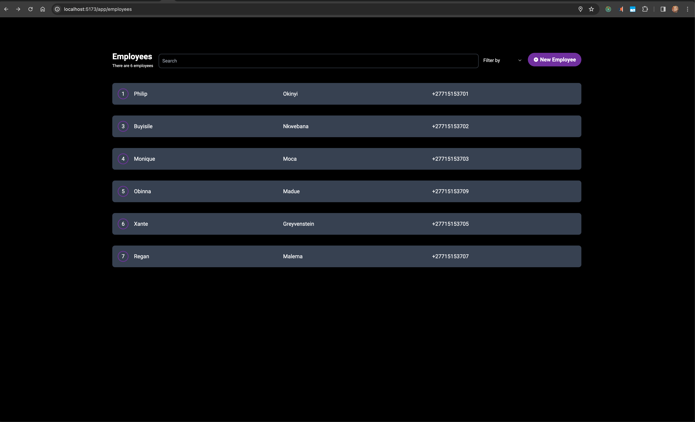
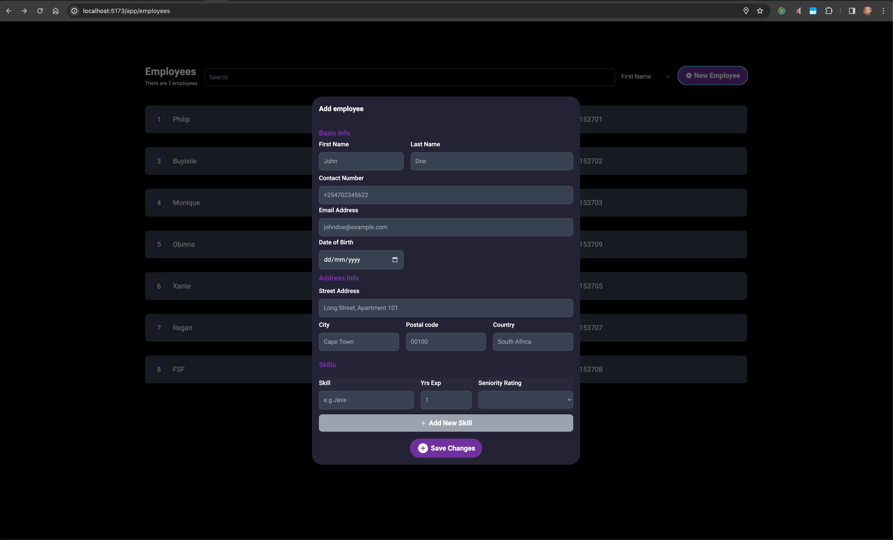
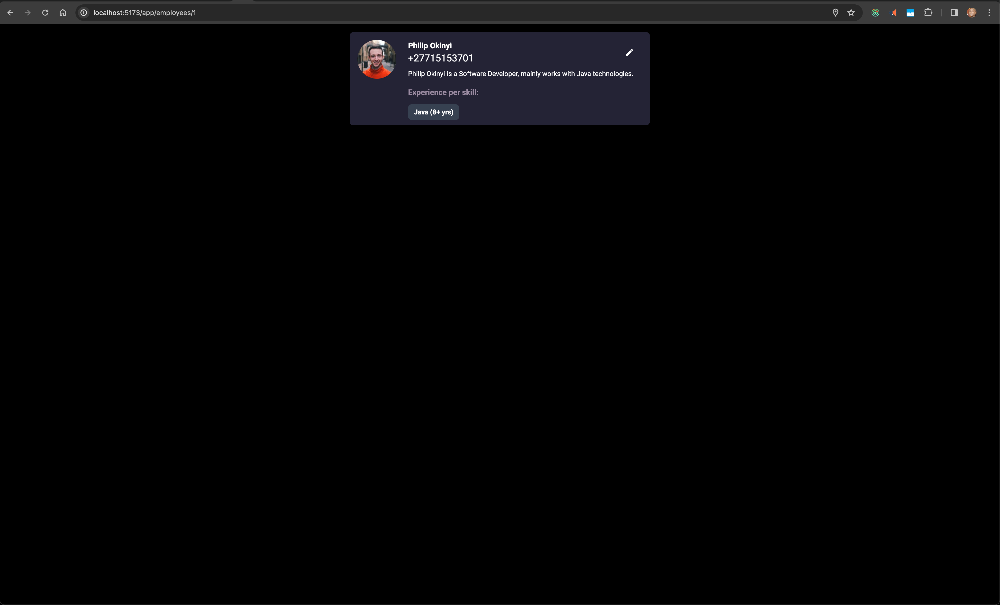
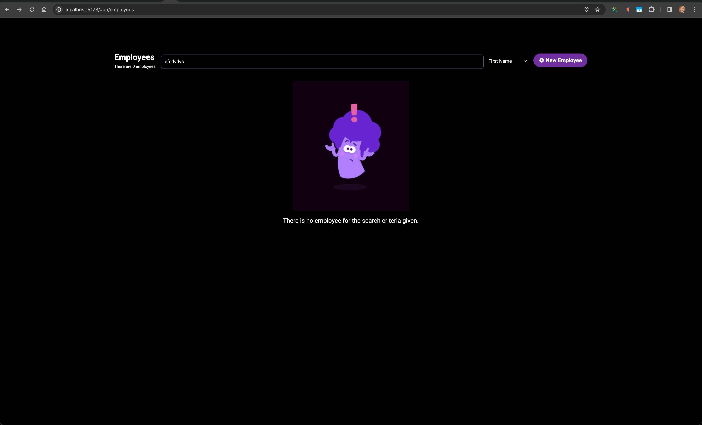
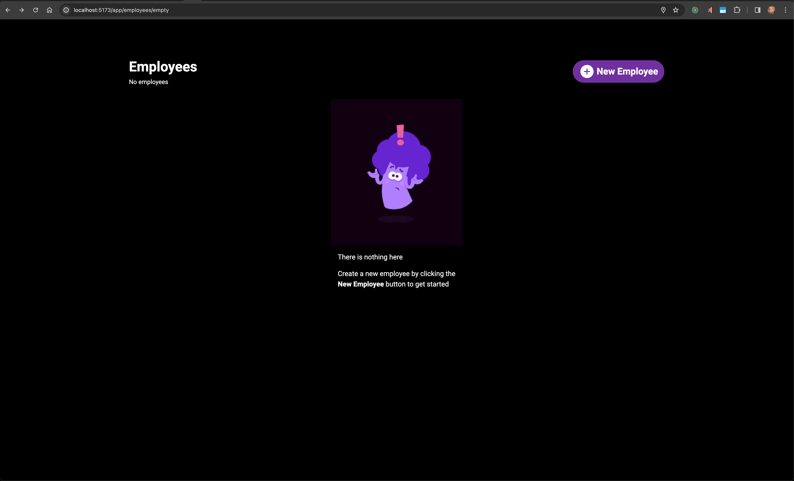

## This is a React frontend for [Employee CRUD backend](https://github.com/ChampIsMe/employee-crud-backend ).

### Features demonstrated:

- [ ] **React redux**
- [ ] CRUD.(Delete is demonstrated in the API docs)

### Info:
- There is minimal test for demonstration due to more effort required in the resto of the app.

## Requirements & Tools used.

- [ ] React ```18.2.0```
- [ ] Node.js ```18.18.2```
- [ ] npm ```10.2.5```
- [ ] M1 (Apple Silicon) OS environment.
### How to run

```npm dev```









